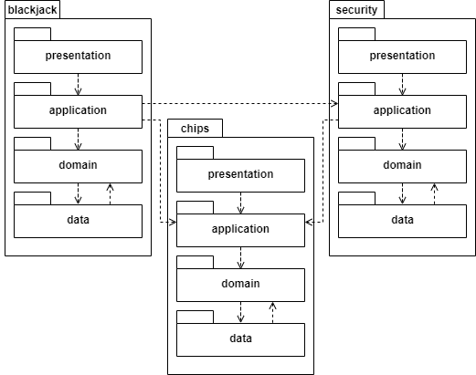

# HUland Casino Project
This project is part of an assignment for the
course Backend Programming 2 (BEP2) at the
Hogeschool Utrecht, University of Applied Sciences.

## Starter project
This starter project contains the following:

* A Maven-based setup with several 
third-party libraries and frameworks (see: `pom.xml`)
* A preconfigured Spring project
* A component and some configuration for a hardcoded user (`nl.hu.bep2.casino.security`)
* A component for basic 
chip functionality (`nl.hu.bep2.casino.chips`)

## Prerequisites
Although it is recommended to always use the latest stable version
of Java, this project requires a version of Java 21 or higher.
You can customize this in your compilation settings and `pom.xml`.

For [Maven](https://maven.apache.org/guides/getting-started/maven-in-five-minutes.html),
you can use your IDE, install it [globally](https://maven.apache.org/download.cgi), 
or use the supplied `mvnw` or `mvnw.cmd`.

## Using the built-in IntelliJ Http-Client
The `bep2-huland-casino.http` file contains a few demo-requests that demonstrate both
how the file-format works, and that the example services work at a basic level.

Each HTTP request is basically formatted as it would be 'on the wire', and requests are 
seperated by 3 ### tokens. 

If opened in IntelliJ (or VS Code, or another supported IDE), each request can be executed by clicking
the small 'play'-icon next to it.

## (Deprecated) Using Postman
The [Postman HTTP client](https://www.postman.com/product/rest-client/) 
can be used as an HTTP client for doing
requests to backend APIs like the one we are building.
Import, use and extend the collection in this repository
found in `hu-land-casino.postman_collection.json`.

Sadly newer versions of Postman are getting progressively worse and more annoying to use.
We'll be moving away from Postman in the near future.

### Automatic authentication and authorisation
In this repository, all authentication is handled by the HardCodedUserResolver. Feel free to 
edit in a different hardcoded user, or a more complicated implementation, 
or peek at the Full-starter-code to see where this is going.

The main point is that security is a complex and complicated topic, but that in most cases you 
can defer implementation to a later date without much difficulty.

## Component overview
Two components, *security* and *chips*, have already been created.
Students will have to make a new component, *blackjack*.
Keep in mind that the blackjack component will start with
an object-oriented domain layer.

It is a good idea to create a package structure that reflects
the application architecture.

## Continuing from the previous phase

You will likely be able to simply copy the blackjack-component code (and hopefully your JUnit tests) from the previous phase
into this application. Please make this a separate commit. Any test-code you wrote in the old `public static void main`
is sadly not so easily migrated, and probably best abandoned (though you may want to investigate a 
[Spring CommandLineRunner](https://www.baeldung.com/spring-boot-console-app#console-application)).

## Goals

At this stage you should be able to add a Controller to play your game of Blackjack as a web-application. You will
probably need to add some form of external Id to your Blackjack games, so you can address them with a proper URL.

At this point we are mostly interested in your choice of URLs, and the way you assign functionality to the different layers
of your program.
